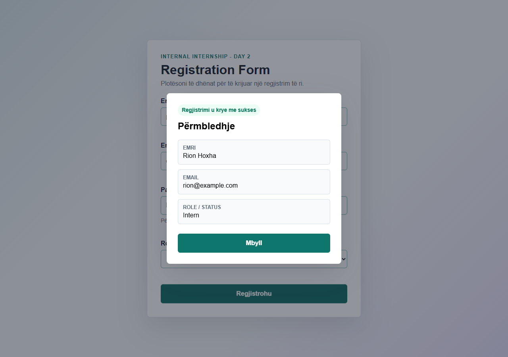

# Day 2 - Task 2: Registration Form

Ky projekt është një formë regjistrimi me validim dhe feedback vizual.

## Çfarë përmban

- Fushat: emër, email, password dhe role/status.
- Validim për email-in dhe gjatësinë minimale të password-it.
- Mesazhe gabimi që nuk e prishin layout-in.
- Dialog me përmbledhje pas submit të suksesshëm.
- Dizajn responsive për mobile dhe desktop.

## Si hapet

Hapni file-in `index.html` në browser.

## Screenshot

## Pjesët kryesore të kodit

- `index.html` mban strukturën e formës dhe dialogun e suksesit.
- `styles.css` mban pamjen responsive dhe feedback-un vizual.
- `script.js` mban validimin, shfaqjen e gabimeve dhe përmbledhjen pas submit.
