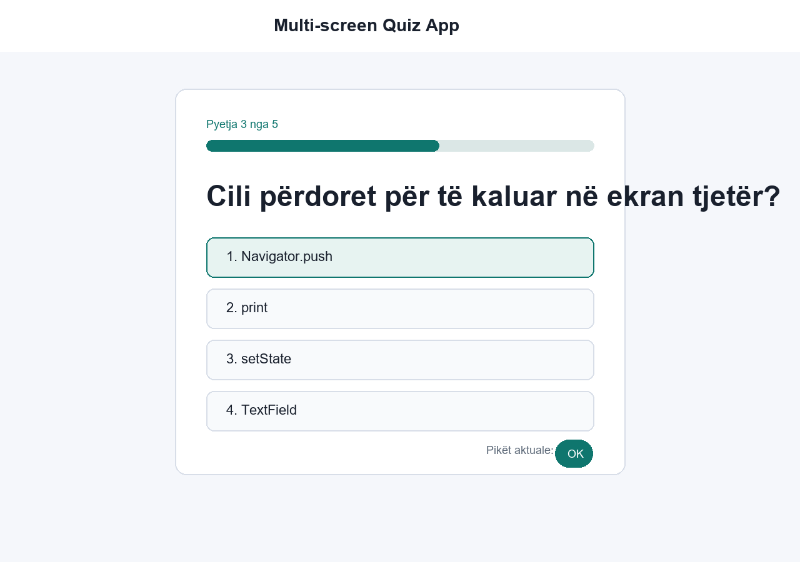

# Day 3 - Task 1: Multi-screen Quiz App

Ky projekt është një aplikacion Flutter për quiz me pyetje, opsione, rezultat dhe restart.

## Kërkesat e përmbushura

- Ka 5 pyetje.
- Çdo pyetje ka 4 opsione.
- Përdor `setState` për pikët dhe pyetjen aktuale.
- Përdor `Navigator.push` për ekranin e rezultatit dhe `Navigator.pop` për restart.
- Ka ekran final me rezultat dhe buton restart.
- Ka feedback me `SnackBar` pas përgjigjes.
- UI është responsive për mobile dhe desktop me `ConstrainedBox`.

## Si ekzekutohet

Në një ambient ku Flutter është i instaluar:

```bash
flutter pub get
flutter run
```

Mund të hapet edhe në FlutLab/Replit duke importuar këto file.

## Screenshot



## Pjesët kryesore të zgjidhjes

- `QuizQuestion` është model class për pyetjen.
- `quizQuestions` ruan listën me pyetje dhe përgjigje.
- `QuizScreen` menaxhon state-in: pyetjen aktuale dhe pikët.
- `ResultScreen` shfaq rezultatin final dhe e kthen përdoruesin në fillim me restart.

## Çfarë mund të shtohet më vonë

- Ruajtje rezultatesh.
- Pyetje nga API.
- Hosting në web pas build-it të Flutter.
