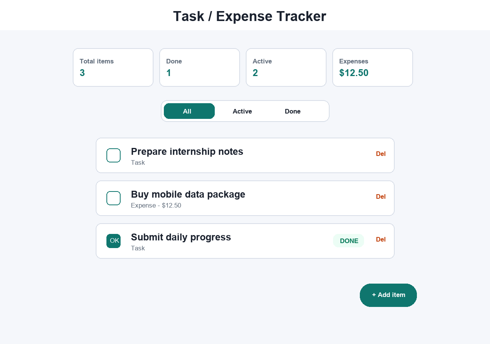

# Day 3 - Task 2: Task / Expense Tracker

Ky projekt është një aplikacion Flutter për menaxhim të task-eve dhe shpenzimeve.

## Kërkesat e përmbushura

- Ka model class `TrackerItem`.
- Përdor `List<TrackerItem>` për të ruajtur items.
- Shton item të ri përmes `AlertDialog`.
- Implementon status `done/active` me checkbox.
- Implementon fshirje të item-it.
- Shfaq total/count për items, done, active dhe expense total.
- Përdor `SnackBar` për veprimet kryesore.
- UI është responsive për mobile dhe desktop me `ConstrainedBox`, `Wrap` dhe lista adaptive.

## Si ekzekutohet

Në një ambient ku Flutter është i instaluar:

```bash
flutter pub get
flutter run
```

Mund të hapet edhe në FlutLab/Replit duke importuar këtë folder.

## Screenshot



## Pjesët kryesore të zgjidhjes

- `TrackerItem` është model class për çdo task/expense.
- `items` është lista dinamike që rifreskohet me `setState`.
- `openAddItemDialog()` shton item të ri me formë në dialog.
- `toggleItemStatus()` kalon item-in nga active në done ose anasjelltas.
- `deleteItem()` fshin item-in dhe shfaq feedback.

## Çfarë mund të shtohet më vonë

- Ruajtje lokale me SharedPreferences.
- Sinkronizim me API ose Cloudflare D1.
- Kategori të personalizuara dhe data për deadline.
