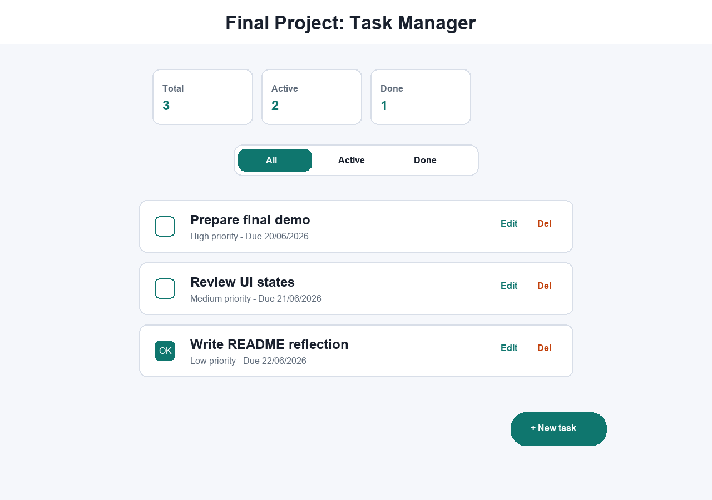

# Day 5 - Final Project: Task Manager MVP

Ky projekt është MVP final për Internal Internship Day 5. Aplikacioni është ndërtuar në Flutter dhe përdor njohuritë nga Day 1-4: state management, navigation, model classes, lista dinamike, forma dhe feedback për përdoruesin.

## Target

Mobile, desktop dhe web në Flutter.

## 3 funksionalitetet minimale

- Menaxhim i task-eve: listë dinamike me active/done.
- Formë për shtim dhe editim task-u.
- Ekran detajesh me navigation dhe veprime kryesore.

## Çfarë funksionon

- Shfaqje e task-eve në ekranin kryesor.
- Shtim i task-eve të reja me formë.
- Editim i title, description, priority dhe due date.
- Hapje e ekranit të detajeve me `Navigator.push`.
- Status active/done me checkbox.
- Fshirje task-u.
- Summary për total, active dhe done.
- `SnackBar` për feedback pas veprimeve.
- UI responsive me `ConstrainedBox`, `Wrap`, `ListView` dhe Material 3.

## Si ekzekutohet

Në një ambient ku Flutter është i instaluar:

```bash
flutter pub get
flutter run
```

Mund të hapet edhe në FlutLab, Replit ose editor tjetër Flutter-ready.

## Screenshot



## Struktura

```text
lib/
  main.dart
  models/
    task_item.dart
  screens/
    home_screen.dart
    task_form_screen.dart
    task_detail_screen.dart
  services/
    task_service.dart
```

## Reflektim teknik

MVP përdor state lokal me `setState`, sepse kërkesat e ditës fokusohen te funksionalitetet bazë dhe dorëzimi i shpejtë. Të dhënat ruhen në memorie përmes `TaskService`. Për një version më të avancuar, mund të shtohet ruajtje lokale, API, autentikim ose backend me Cloudflare D1.

## Çfarë mbetet për shtesë

- Ruajtje lokale me SharedPreferences ose SQLite.
- Sync me API ose Cloudflare D1.
- Kërkim dhe kategori të personalizuara.
- GitHub Pages/Flutter web hosting pas build-it.
